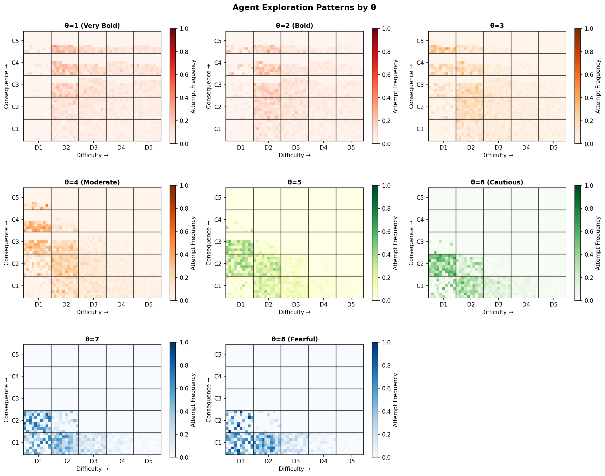
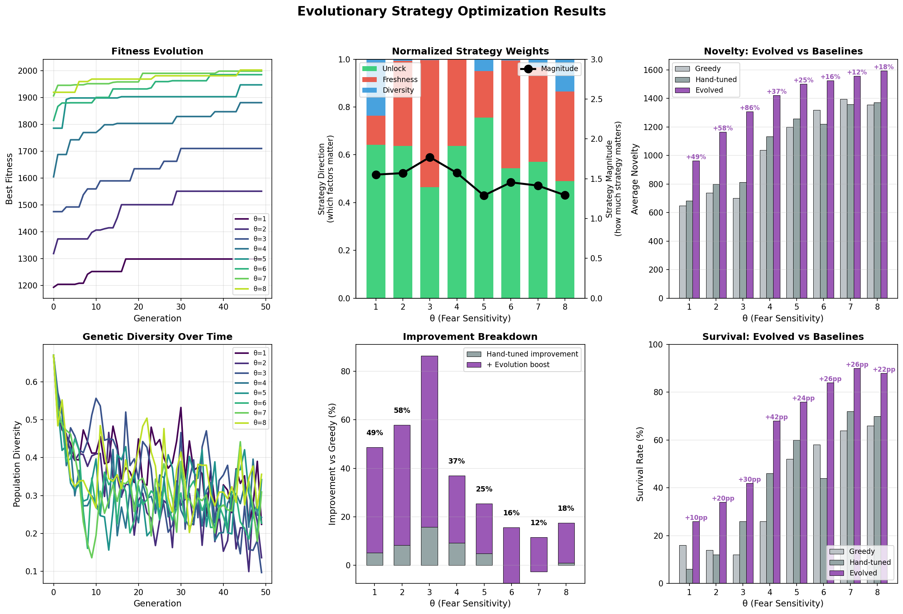

# Agent8 Climber v1 - Fear-Based Exploration with Evolutionary Strategy Optimization

A simulation exploring how different fear sensitivities (θ) lead to different exploration trajectories, with evolutionary optimization to discover optimal strategies for each personality type.

## What Is This?

This project models **how people with different risk tolerances explore uncertain territories** - using rock climbing as a metaphor.

Imagine two climbers:
- **Bold Alex (θ=2)**: Accepts high risk, accesses dangerous routes, might die early but explores intensely
- **Cautious Agent8 (θ=8)**: Avoids risk, sticks to safer routes, survives longer but has fewer options

The key question: **Can both accumulate similar novelty and develop skills despite opposite approaches?**

### Methodology

The project uses two complementary techniques:

- **Monte Carlo Simulation**: Runs hundreds of stochastic agent "careers" per configuration to gather statistics on novelty, skill development, and survival outcomes.

- **Evolutionary Optimization**: Discovers optimal strategy weights for each personality type by evolving populations of strategies and selecting for fitness (novelty + skill).

### What the Simulation Tracks

**Novelty**: The value gained from exploration - highest when operating at the edge of your comfort zone (fear ≈ 0.75-0.80). Too safe feels boring, too scary is overwhelming. Novelty also decays with repetition - fresh routes yield more than familiar ones.

**Skill**: Two types that develop through experience:
- **Physical skill**: Trained by attempting difficult routes. Builds confidence, reduces difficulty fear, improves success probability.
- **Mental skill**: Trained by exposure to consequence (risk). Reduces "choking under pressure" - the tendency to fail when stakes are high.

**Survival**: Completing a full career without a fatal accident. When you fall, death probability equals the route's consequence rating.

### The Core Dynamic

Skills unlock continued exploration:
- Physical skill **reduces fear of difficulty** → harder routes become accessible
- Mental skill **prevents choking** → better performance on high-stakes routes  
- Both accumulate over a career, but only if you survive long enough

## Core Thesis

> "Everyone finds novelty at THEIR edge"

Bold climbers (low θ) and cautious climbers (high θ) can achieve similar novelty when operating at their personal edge—but **strategy matters differently** depending on personality, and we can **evolve optimal strategies** for each type.

### Territorial Differentiation



*Bold agents (θ=2) explore vertically (consequence), cautious agents (θ=8) explore horizontally (difficulty).*

---

## Table of Contents

1. [Quick Start](#quick-start)
2. [The Model](#the-model)
3. [Strategic Route Selection](#strategic-route-selection)
4. [Evolutionary Optimization](#evolutionary-optimization)
5. [Landscapes](#landscapes)
6. [Running Experiments](#running-experiments)
7. [Key Findings](#key-findings)
8. [File Structure](#file-structure)

---

## Quick Start

```bash
# 1. Basic exploration (greedy agents)
python run_exploration.py --quick --landscape compressed --plot

# 2. Strategic exploration with default weights
python run_strategic_exploration.py --quick --landscape compressed --thetas 2,4,6,8 --plot --heatmap

# 3. Evolve optimal strategies and save them
python run_evolution.py --landscape compressed --thetas 2,4,6,8 --plot --save output/optimal_weights.json

# 4. Run strategic exploration with evolved weights
python run_strategic_exploration.py --landscape compressed --thetas 2,4,6,8 --load-weights output/optimal_weights.json --plot --heatmap
```

---

## The Model

### Agent Fear Sensitivity (θ)

```
θ = 1-2: Bold (like Alex Honnold) - accepts ~12-27% death risk
θ = 3-4: Moderate - accepts ~4-7% death risk
θ = 6-8: Cautious - accepts ~1-2% death risk
```

### The Fear Function

Fear determines which routes an agent will attempt:

```python
fear = consequence_fear + difficulty_fear

# Consequence fear (personality-dependent)
lauda_line = 0.35 × exp(-0.6 × θ) + 0.01  # Personal risk threshold
consequence_fear = route.consequence / lauda_line

# Difficulty fear (skill-dependent, decays with experience)
confidence = physical_skill / (2.0 + physical_skill)
difficulty_fear = 0.5 × difficulty × (1 - confidence) × habituation
```

A route is **accessible** if `fear ≤ 1.0`.

### Route Value (How Agents Choose)

Agents don't just pick accessible routes randomly - they evaluate **value**:

```python
value = fear_sweetness × stakes_engagement × novelty_potential

# Fear sweetness: Bell curve peaking at optimal fear (~0.75)
fear_sweetness = exp(-((fear - 0.75) / 0.3)²)

# Stakes engagement: Bold climbers need real consequence to feel engaged
required_consequence = 0.025 / θ
stakes_engagement = min(1.0, route.consequence / required_consequence)

# Novelty potential: Fresh routes yield more than repeated ones
novelty_potential = base × engagement × freshness
```

**Key insight**: The same route has different value for different personalities because they experience different fear levels.

### Two-Skill System

| Skill | Trained By | Effect |
|-------|------------|--------|
| **Physical** | Route difficulty | Reduces difficulty fear, improves success rate |
| **Mental** | Consequence exposure | Reduces choking under pressure |

**Success probability**:
```python
p_physical = base_success × (1 + physical_skill / (1 + physical_skill))
p_choke = consequence × (1 - mental_capacity) × 5
p_success = p_physical × (1 - p_choke)
```

### Outcome Tracking

Each agent's career ends one of three ways:

| Outcome | Meaning |
|---------|---------|
| **Completed** | Finished all max_attempts (full career) |
| **Stagnated** | Ran out of acceptable routes (alive but stuck) |
| **Dead** | Fatal accident (fall + unlucky on consequence roll) |

---

## Strategic Route Selection

### Greedy vs Strategic

**Greedy Agent**: Picks route with highest immediate value (see formula above)

**Strategic Agent**: Adds three behavioral bonuses to immediate value:

```python
strategic_value = immediate_value + unlock_bonus + freshness_bonus + diversity_bonus
```

### Strategy Weights (Behaviors)

| Weight | Formula | Effect |
|--------|---------|--------|
| `unlock_weight` | `weight × min(n_almost, 20) × difficulty` | Prefer routes that build skill when there are "almost accessible" routes nearby |
| `freshness_weight` | `weight × 50 × exp(-0.5 × experience)` | Prefer routes not recently attempted |
| `diversity_weight` | `weight × 100` (if new grid cell) | Prefer routes in unvisited areas of the landscape |

### Why Strategy Matters

Without strategy, greedy agents:
- Deplete their favorite routes quickly (stagnation)
- Miss opportunities to unlock new territory through skill building
- Cluster in one corner of the landscape

Strategic agents spread exploration, avoid exhaustion, and unlock more routes over time.

---

## Evolutionary Optimization

### The Goal

Find the optimal `[unlock_weight, freshness_weight, diversity_weight]` for each θ.

### How It Works



*Strategy magnitude decreases with θ: bold climbers need MORE strategy to survive.*


```
GENERATION 0: Random Population
┌─────────────────────────────────────────────────────────┐
│  Individual    Weights [u,f,d]      Fitness             │
├─────────────────────────────────────────────────────────┤
│  A             [0.1, 0.8, 0.3]    → 30 runs → 1200      │
│  B             [0.5, 0.1, 0.7]    → 30 runs → 1350      │
│  C             [0.3, 0.2, 0.4]    → 30 runs → 1450 ★    │
│  D             [0.9, 0.2, 0.1]    → 30 runs → 1100      │
└─────────────────────────────────────────────────────────┘
                         │
                         ▼
              SELECTION (keep top 50%)
              CROSSOVER (blend parent genes)
              MUTATION (add random noise)
                         │
                         ▼
              ... repeat for 30 generations ...
                         │
                         ▼
FINAL: Optimized Weights for this θ
┌─────────────────────────────────────────────────────────┐
│  Best: [0.45, 0.22, 0.38]  Fitness: 1620                │
└─────────────────────────────────────────────────────────┘
```

### Fitness Function

Fitness is what we optimize for (the **goals**):

```python
fitness = novelty_weight × avg_novelty 
        + survival_weight × avg_survival × 1000 
        + skill_weight × avg_skill × 100
```

Default weights: `novelty=1.0, survival=0.0, skill=0.5`

### Normalized Weights: Magnitude + Direction

Raw strategy weights are decomposed into interpretable components:

```
magnitude = sum(weights)           # How much strategy matters overall
direction = weights / magnitude    # Which behaviors matter most (sums to 100%)
```

**Magnitude Interpretation:**

| Range | Label | Meaning |
|-------|-------|---------|
| > 2.0 | CRITICAL | Strategy is essential for survival |
| 1.5 - 2.0 | IMPORTANT | Strategy significantly helps |
| 1.0 - 1.5 | MODERATE | Strategy provides benefit |
| < 1.0 | OPTIONAL | Natural fear provides sufficient guidance |

### Save and Load Evolved Weights

```bash
# Step 1: Run evolution and save weights
python run_evolution.py --landscape compressed --thetas 1,2,3,4,5,6,7,8 --plot --save output/optimal_weights.json

# Step 2: Use evolved weights in strategic exploration
python run_strategic_exploration.py --landscape compressed --thetas 1,2,3,4,5,6,7,8 --load-weights output/optimal_weights.json --plot --heatmap
```

The JSON file contains per-θ optimal weights and performance metrics.

---

## Landscapes

### Compressed Landscape (Recommended)

Ultra-tight consequence bands designed so ALL θ values can explore the full grid:

```python
landscape = Landscape.create_compressed(seed=42)
```

```
                        CONSEQUENCE
              C1        C2        C3        C4        C5
           (0.1%)    (0.4%)    (0.7%)    (1.2%)    (2.0%)
         ┌─────────┬─────────┬─────────┬─────────┬─────────┐
    D1   │   500   │   500   │   500   │   500   │   500   │  Easy
         ├─────────┼─────────┼─────────┼─────────┼─────────┤
    D2   │   500   │   500   │   500   │   500   │   500   │
         ├─────────┼─────────┼─────────┼─────────┼─────────┤
    D3   │   500   │   500   │   500   │   500   │   500   │
         ├─────────┼─────────┼─────────┼─────────┼─────────┤
    D4   │   500   │   500   │   500   │   500   │   500   │
         ├─────────┼─────────┼─────────┼─────────┼─────────┤
    D5   │   500   │   500   │   500   │   500   │   500   │  Hard
         └─────────┴─────────┴─────────┴─────────┴─────────┘
                                                    = 12,500 routes
```

**Why compressed?** 
- All θ values can access most of the grid
- Enables fair comparison of exploration patterns
- Reveals territorial differentiation by personality

### Other Landscapes

```python
# Fair: Routes calibrated per-θ (equal access by design)
landscape = Landscape.create_fair(thetas=[2, 4, 6, 8])

# Stratified: Uniform grid, wider consequence range
landscape = Landscape.create_stratified_coverage(seed=42)
```

---

## Running Experiments

### Basic Exploration (Greedy)

```bash
python run_exploration.py --quick --landscape compressed --plot --heatmap
python run_exploration.py --full --landscape compressed --thetas 1,2,4,6,8 --plot --heatmap
```

### Strategic Exploration

```bash
# With default weights
python run_strategic_exploration.py --quick --landscape compressed --thetas 2,4,6,8 --plot --heatmap

# With evolved weights
python run_strategic_exploration.py --landscape compressed --thetas 2,4,6,8 --load-weights output/optimal_weights.json --plot --heatmap
```

### Evolutionary Optimization

```bash
# Quick test (~5 min)
python run_evolution.py --quick --landscape compressed --thetas 4,8 --plot

# Standard run (~20 min)
python run_evolution.py --landscape compressed --thetas 2,4,6,8 --plot --save output/optimal_weights.json

# Full optimization (~1 hour)
python run_evolution.py --full --landscape compressed --thetas 1,2,3,4,5,6,7,8 --plot --heatmap --save output/optimal_weights.json
```

### Command Line Options

| Option | Description |
|--------|-------------|
| `--quick` | Fewer runs/generations (fast) |
| `--full` | More runs/generations (precise) |
| `--thetas` | Comma-separated θ values |
| `--plot` | Generate learning curves |
| `--heatmap` | Generate exploration heatmaps |
| `--landscape` | `compressed`, `fair`, or `stratified` |
| `--seed` | Random seed |
| `--max-attempts` | Max attempts per agent |
| `--save` | Save evolved weights to JSON |
| `--load-weights` | Load evolved weights from JSON |

---

## Key Findings

### 1. Equal Novelty at Personal Edge

Agents across all θ values achieve similar novelty when operating at their sweet spot (fear ≈ 0.75). The absolute difficulty doesn't matter - what matters is being challenged relative to your own threshold.

### 2. Territorial Differentiation

Bold and cautious climbers explore different regions of the landscape:
- **Bold (low θ)**: Vertical exploration (consequence dimension) - they can access high-risk routes
- **Cautious (high θ)**: Horizontal exploration (difficulty dimension) - they push technical skill within safe zones

### 3. Strategy Magnitude Varies by Personality

| θ | Magnitude | Interpretation |
|---|-----------|----------------|
| 1-2 | ~2.0+ | CRITICAL - bold climbers need strategy to survive their risky territory |
| 3-4 | ~1.5 | IMPORTANT - strategy helps significantly |
| 5-6 | ~1.0 | MODERATE - strategy provides benefit |
| 7-8 | ~0.7 | OPTIONAL - natural fear provides sufficient guidance |

### 4. Strategic Agents Avoid Stagnation

| Agent Type | Stagnation Rate |
|------------|-----------------|
| Greedy | 20-40% (exhaust favorite routes) |
| Strategic | ~0% (freshness/diversity spread exploration) |

### 5. Death Timing Matters

Expected novelty depends not just on survival rate, but on *when* deaths occur:
- Early death = low total novelty (wasted potential)
- Late death = high total novelty (productive career before accident)

Cautious agents who die tend to die late (after accumulating skill/novelty). Bold agents who die may die early (before accumulating much).

---

## File Structure

```
agent8_climber_v1/
├── run_exploration.py              # Greedy agent exploration
├── run_strategic_exploration.py    # Strategic exploration (with --load-weights)
├── run_evolution.py                # Evolutionary optimization (with --save)
│
├── src/
│   ├── agent.py                    # Agent with fear model and two-skill system
│   ├── strategic_agent.py          # Strategic agent with planning behaviors
│   ├── evolution.py                # Evolutionary optimizer
│   ├── landscape.py                # Route generation (incl. compressed)
│   ├── exploration.py              # Simulation loop
│   └── visualizations.py           # Plotting utilities
│
├── output/
│   ├── learning_curves.png
│   ├── exploration_heatmap.png
│   ├── progression_heatmap.png
│   ├── evolution_results.png
│   └── optimal_weights.json        # Evolved weights (from --save)
│
├── .gitignore
├── requirements.txt
└── README.md
```

---

## Requirements

```
Python 3.8+
numpy
matplotlib
```

Install with: `pip install -r requirements.txt`

---

## Example Workflow

```bash
# 1. Quick exploration to verify setup
python run_exploration.py --quick --landscape compressed --thetas 2,4,6,8 --plot

# 2. Evolve optimal strategies for each θ
python run_evolution.py --landscape compressed --thetas 2,4,6,8 --plot --save output/optimal_weights.json

# 3. Run strategic exploration with evolved weights
python run_strategic_exploration.py --landscape compressed --thetas 2,4,6,8 --load-weights output/optimal_weights.json --plot --heatmap

# 4. Full production run (all θ values)
python run_evolution.py --full --landscape compressed --thetas 1,2,3,4,5,6,7,8 --plot --heatmap --save output/optimal_weights.json
```

---

## Acknowledgments

Thanks to Sophie Herzog for ideas and critique.

---

## License

MIT